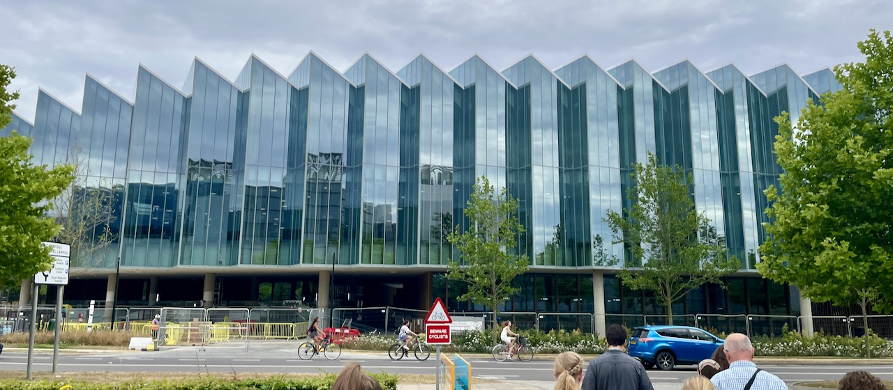
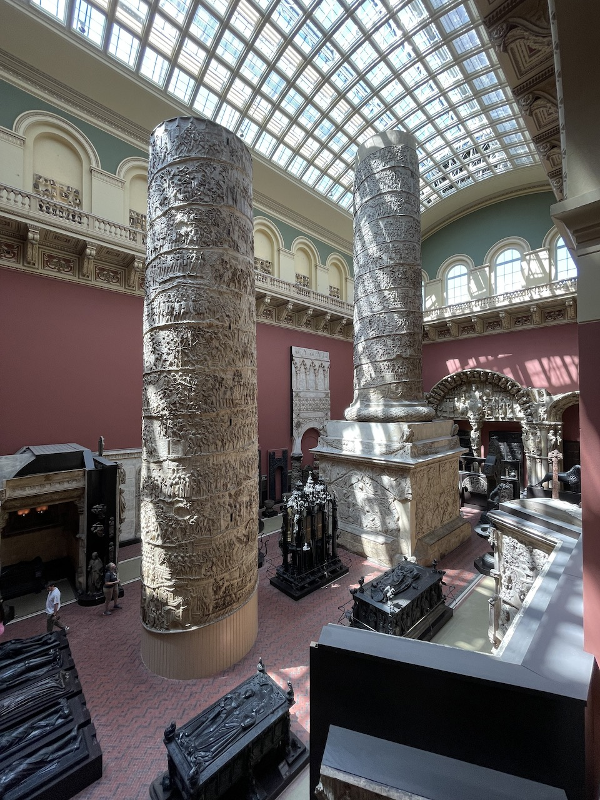
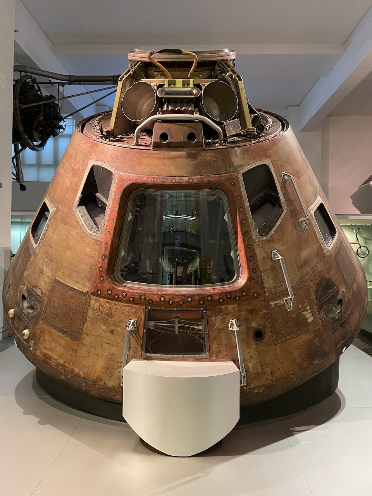

## Travel Map

## Contents
- **[Cambridge](#cambridge)**
	- [Wednesday, July 13](#tuesday-july-13)
	- [Tuesday, July 12](#tuesday-july-12)
- **[London](#london)**
	- [Monday, July 11](#monday-july-11)
	- [Sunday, July 10](#sunday-july-10)
	- [Saturday, July 9](#saturday-july-9) - Tower of London and Abbey Road
	- [Friday, July 8](#friday-july-8) - Natural History and Science Museum
	- [Thursday, July 7](#thursday-july-7) - King's Cross and The Mousetrap
	- [Wednesday, July 6](#wednesday-july-6) - Kew Royal Botanical Gardens
	- [Tuesday, July 5](#tuesday-july-5) - London Museum
	- [Monday, July 4](#monday-july-4) - Grant Museum and Paddington
	- [Sunday, July 3](#sunday-july-3) - Wimbledon
	- [Saturday, July 2](#saturday-july-2) - Kensington Palace

## Cambridge

### Wednesday, July 13

This morning we stopped by the Cavendish Laboratory, where the structure of DNA and about a million other things were discovered.  We didn't get to go in, because the labs are actually used for psychology and sociology studies these days (to my professors' dismay), but the buildings were very nice.

If you though the 12 Nobel Prize winners coming out of the LMB yesterday was impressive, just wait until you hear about Cavendish.  It has produced a total of [30 laureates](https://en.wikipedia.org/wiki/Cavendish_Laboratory#Nobel_Laureates_at_the_Cavendish), with the first being in 1904 and the most recent in 2019.

 
*History of Cavendish Labs*

 
*Location of the discovery of the electron...*

 
*...and of something else that I hardly understand*

Being microbiology majors (apart from Josh and I), we were at Cavendish Labs primarily because of its role in Watson and Crick's discovery of DNA's double helix structure.  Just down the street is The Eagle, the pub where they announced their discovery.

 
*The Eagle pub*

 
*Another plaque, commemorating Crick and Watson (and Franklin)*

It seemed obligatory to get a drink at this historic site, so I purchased myself an alcohol free beer.  It was terrible.

 
*Taking a drink in commemoration of the work of Watson and Crick*

After our visit to the pub, and with my non-alcoholic drink still in hand and unfinished, we went to punt the Cam.  Punting looks similar to taking a gondola ride, but instead of using an oar, the punter just uses a big stick to push the punt along the river.

 
*Us in our punt, from the perspective of our punter, Dylan*

 
*The other half of our group on the Cam*

 
*Punting the Cam with MacKayla and Sam! (rhyme intended)*

In the background of the previous photo you'll see other people punting, as well as the Bridge of Sighs.  This bridge is to be confused with the Bridge of Sighs in Venice, Italy, nor with the Bridge of Sighs in Oxford, England.  It is also not to be confused with *Bridge of Spies*, featuring Tom Hanks.  In addition to its confusing name, Cambridge's Bridge of Sighs is also known for being the place where engineering students [suspended a car over the river](https://www.cambridge-news.co.uk/news/cambridge-news/how-cambridge-university-pranksters-managed-17836295) as a prank.

Before the boat trip was over I finally managed to gag down the last few drops of my beer.

Afterwards, we wandered through the town a bit, stopping at different shops as we went.  Eventually I ended up at the Fitzwilliam Museum, which had some really interesting art pieces.  One part of the museum was a special exhibit on [David Hockney](https://en.wikipedia.org/wiki/David_Hockney).  I really liked the display of his digital art, mostly for the great description it had:

> "When Hockney discovered the iPhone, and subsequently the iPad, as drawing tools he was excited by their potential. 'This is a real new medium', he explained, 'So much variety is possible. You can't overwork this because it's not a real surface.  And you can put anything on anything: a bright, bright blue on top of an intense yellow.' . . . As he said, 'I draw flowers every day and send them to friends, so they get fresh flowers every morning. And my flowers last!'"

 
How to Make Flowers Last *by David Hockney—the screen cycled through different digital paintings*

Another really interesting display involved a work by Nicholas Poussin.  Poussin was known for setting up 3D models to base his paintings off of in order to better account for lighting and depth.  Although it's not known for sure whether he used a model for the painting below, it is considered likely, and a model similar to what he may have used was constructed for the museum display.

 
Extreme Unction *by Nicholas Poussin*

 
*Recreation of Poussin's possible 3D model*

Before the museum closed, we stopped by the gift shop, where I found some great socks featuring Ada Lovelace.  I'm not really sure how she relates to anything on display in the Fitzwilliam Museum, but she is widely considered to be the first computer programmer, so I had to buy them.

 
*"That brain of mine is something more than merely mortal; as time will show." – Ada Lovelace (This has proven to be true historically for Ada, and I believe it is a spiritual truth applicable to each of us.)*

After the museum, I got a tiny scoop of gelato.  I know failing to mention it would disappoint my sister.

 
*Single scoop of treacle at Jack's Gelato*

After dessert, we picked up some real food at the grocery store and had a picnic in one of the parks.  When we were done eating, we played cards and MacKayla taught us some self-defense moves.

 
*Wearing my sandwich as a hat, ready to fight*

> #### MMBIO Writeup: Cavendish Laboratory
>
> **Historical Significance**
> - A whole ton!  In addition to the discovery of DNA at Cavendish Laboratory, about a million other things have been discovered there as well.
>
> **Scientific Principles**
> - *Importance of gathering data*—it was by combining all the data that they and others had collected that Watson and Crick were able to come to their conclusion about the structure of DNA (see the writeup for [Double Helix at the Science Museum](#mmbio-writeupdouble-helix-at-the-science-museum))
>
> **Today's Application**
> - Recognizing all the scientific discoveries that have been made—even over just a short period of time in a single location—helps us to see how much room there is for new discoveries to keep being made.
>
> **Coolest Part**
> - Just the sheer number of Nobel Prizes that have come out of a single research laboratory is incredible to me.

### Tuesday, July 12

Today we took a charter bus to Cambridge.  The bus ride was nice, and I got MacKayla to watch *The Imitation Game* with me during the trip, on the condition that I will watch *Hidden Figures* with her.  I think all the time we spent at the Science Museum on [Friday](#friday-july-8) might have had some influence on that agreement.

All of the guys in our group are staying at Westminster College, and **wow** the rooms are nice.  We each get a room to ourselves, complete with connected bathrooms and kitchen areas.  This is especially wonderful compared to having 9 to a room and sharing the bathrooms with the girls, as was the case in London.

 
*Westminster College*

 
*Room at Westminster College*

After dropping our things off in our rooms, we all headed over to the Whipple Museum of the History of Science.  The museum wasn't very large, but they did have a huge range of items—primarily tools that would have been used for scientific study or teaching.

 
*Glass models of fungi*

 
*"Darwin's main research instrument from its purchased in 1847 to his death in 1882"*

After the Whipple Museum, we took a bus over to the Addenbrook's Hospital, where a BYU alum named John showed us around.  John is doing research on brain tumors, so we got to see the lab where he does most of his work, and then he also took us over to see the Laboratory of Molecular Biology.  The LMB has been home to the work of 12 different Nobel Prize laureates.

 
*Outside the LMB*

 
*John Kendrew's Nobel Prize for Chemistry*

 
*Printout of a map of human deoxyhaemoglobin generated on a computer using the FORTRAN programming language*

 
*Ampersand statue outside the LMB.  Not really sure what it's supposed to mean, but the colors remind me of a DNA sequence*

Right across from the LMB is the AstraZeneca building.  We didn't get to go inside, but it was still cool to see the headquarters of a company that came into the world spotlight so fairly.

 
*AstraZeneca building*

Before heading back to our rooms for the evening, we walked by Newton's Apple Tree, or more accurately, Son of Newton's Apple Tree, since it was grafted from the apple tree that stood outside Sir Isaac Newton's home.

 
*Son of Newton's Apple Tree*

Most places closed around 5 (other than the pubs of course, where I imagine things were just getting started), so even by the time we made it back to Westminster I still had a few hours to spare.  Just getting to relax in my room by myself for a few hours was probably one of my favorite parts of this trip so far.  I took a shower, worked on catching up on some travel entries, and called my sister over FaceTime.  It's unfortunate that we're only staying in Cambridge for two nights, but if we're lucky maybe we'll get to have rooms like this again.

> #### MMBIO Writeup: Whipple Museum
>
> **Historical Significance**
> - The Whipple Museum houses scientific tools and materials that date back multiple centuries.  Seeing these items helps us to better understand how science has been carried out and developed over time.  Science is all about discovery, and building upon the discoveries of the past is how we come to discover more and more.
>
> **Scientific Principles**
> - *Improvement*—all of the scientific discoveries—and tools that allowed those discoveries—displayed in the Whipple Museum were a result of people choosing not to be satisfied with the status quo.  By taking what we already have, whether that be knowledge or an instrument, and working to improve upon it, science progresses.
>
> **Today's Application**
> - Understanding the history of science helps us to build the foundational knowledge that is needed to make new discoveries.  History also provides us with successful examples of using the scientific method, which can help us to develop frameworks for modern experiments.
>
> **Coolest Parts**
> - On a shelf in the museum were a variety of case studies written by professors, curators, and students.  It was fun to see how someone's research can end up being somewhere really interesting for all to read, rather than just being lost to the depths of the internet.  Some of the case studies can be found [here](https://doi.org/10.1017/9781108633628).

## London

### Monday, July 11

We started off today by going to the changing of the guard at Buckingham Palace.  It was a bit disappointing, not because of anything wrong with the way it was carried out, but simply because there were so many people it was impossible to see much.  I remember seeing the changing of the guard at the Tomb of the Unknown Soldier in Washington, D.C. a few years ago, so I was hoping for an experience something like that.  I think I felt like the one at Buckingham was more for show, whereas the one in D.C. felt more purely out of respect for who they were guarding.  I'm sure each have some elements of both show and respect though.

 
*Procession for the changing of the guard*

 
*This was about the best I could see as far as what was actually happening within the gates of Buckingham Palace goes*

After the changing of the guard we went to the Imperial War Museum.  I'm not exactly sure what they mean by "Imperial" in the name, but the museum covered multiple wars, including World War I and II.

 
*Outside the Imperial War Museum*

 
*Land Rover used in Gaza - [more info](https://www.iwm.org.uk/collections/item/object/70000517)*

 
*A Japanese Zero that was discovered 50 years after the war*

I spent most of my time in their exhibit on the Holocaust.  I thought the exhibit was laid out really well.  It started off with some historical background and introduced a ton of individuals who would have been affected by the Holocaust.  The exhibit really helped me get to know those people by teaching me about their lives, their families, and their interests.  It helped me feel close to them and really comprehend that the victims of the Holocaust  were real people with lives just like my own and those of my friends and family.

 
*"Siblings Ruth and Klaus Boronow with their cat Roswitha at home in Breslau, Germany."*

The exhibit also of course taught about Hitler and his followers.  I think one of the most sickening parts of it all is recognizing that the Nazis were people as well and that they too had lives and families and interests.  It's easy to just blame everything on Hitler, but when you start to recognize how many other individuals were complicit in everything that happened, it's terrifying.  It's terrifying that one person could do such awful things, and it's even more terrifying that a whole bunch of people—many who would otherwise seem just like you and I—could do those things.

 
*"In this photograph, a hanukkiah holding candles for the Jewish festival of Hanukkah sits in the home of Rabbi Dr Akiva Posner and his wife Rachel.  On the back of the image Rachel Wrote, 'Hanukkah 5692 (1932). The flag says, "Death to Judah".  The light answers, "Judah will live forever".'"*

Another difficult part was learning about how many children had to be separated from their families in order to find safety.  The part of the exhibit on that included many of the possessions of those children, along with their stories.  I admire the bravery and love of both the parents and children who had to go through that and the countless other challenges of that time.  And I'm grateful for my own family and the great love I know they have for me.

 
*"Steffi Leyser's father gave her this wallet for her travel documents.  He had received it as a boy as a gift for his bar mitzvah.  Steffi's favorite uncle gave her this puppet, which was one of the few items she was allowed to choose and pack for herself."*

Seeing the Holocaust exhibit was really powerful.  Lots of museums do a great job of showing off planes and tanks and guns, but they often are limited in how they acknowledge the costs that lie behind those things.  The Holocaust exhibit was a reminder of the cost of war, as well as a reminder of why we must choose to fight at times.

After our visit to the Imperial War Museum I split off with Dallin and MacKayla to go to Westminster Abbey.

 
*Westminster Abbey*

 
*Me, Dallin, and MacKayla outside Westminster Abbey*

The inside of the Abbey was beautiful.  Below is the view of where we came in once they had started clearing people out and getting ready for evensong.

 
*Inside the Abbey*

A ton of important people are buried at Westminster Abbey, including scientists, royalty, and writers.  It also turns out they have a grave of an unkown soldier of their own, just like the one in D.C. that I was talking about.  It's the only grave that you aren't allowed to walk on in the Abbey.

 
*Grave of the Unknown Warrior*

Among the graves of scientists were Sir Isaac Newton, Charles Darwin, Michael Farraday, James Watt, and most recently, Stephen Hawking.

 
*Stephen Hawking's grave*

Nearby is what I thought was a grave, but it turned out to be just a memorial.  A lot of the memorials were on the walls rather than the floor, so I imagine it's significant that this one was allowed to take up precious floor space where someone else could have otherwise been buried.

 
*Memorial to Nelson Mandela*

There's a lot of royalty buried in Westminster Abbey as well.  Even with my extensive knowledge gained from my 10 days in London, I still have trouble keeping track of all the different Henrys and Elizabeths.  There were a few graves that distinctly stood out however.  The first were those of Mary (Queen of Scots) and Elizabeth (I), two cousins who had a fierce political rivalry stoked by religious differences.  In 1587, [Mary was executed](https://www.rmg.co.uk/stories/topics/elizabeth-i-mary-queen-scots) as punishment for conspiracy to kill Elizabeth.  Years later, Mary's son had her body exhumed and placed alongside Elizabeth's in Westminster Abbey.  I really like the inscription that was placed at the heads of their tombs.

 
*The inscription explains part of why Mary and Elizabeth were placed side-by-side, despite their rivalry*

Just across from Mary and Elizabeth are the bones that were found hidden in the walls at the Tower of London (see [July 9](#saturday-july-9)) and believed to be those of the princes Edward V and Richard.

 
*Bones discovered in the Tower of London and attributed as being those of Edward V and Richard*

Like many cathedrals, Westminster Abbey is constructed in the shape of a cross.  At the top of the cross is the Lady Chapel, which the audio guide described as being a sort of chapel within a chapel (a side chapel) dedicated to St. Mary.

 
*The ceiling and windows of the Lady Chapel were beautiful*

 
*At the center lies an altar dedicated to the Virgin Mary*

The part of Westminster that I was most excited to see was Poet's Corner.  Poet's Corner is an area of the Abbey devoted to poets, writers, playwrights, and composers.  It consists of a large square cluster of graves as well as some others nearby, along with a ton of other memorials on the walls and even in the windows.

 
*Poet's Corner graves*

 
*Memorials to various writers, including Shakespeare at the center with plaques for Jane Austen and the Bronte sisters on either side*

 
*I know my grandpa is a huge fan of Kipling, so I made sure to get a picture by his grave specifically.  To the left is the grave of Charles Dickens, and above that is George Handel's*

And that ends your digital tour of Westminster Abbey!

 
*Leaving the Abbey*

Surrounding the nearby Parliament Square Garden are statues of a few different prominent figures, including Nelson Mandela, Gandhi, and Abraham Lincoln.  Maybe you can find a theme in there?

 
*Millicent Fawcett, a prominent leader in the women's suffrage movement of the UK.  The first statue of a woman and by a woman to be placed in Parliament Square*

After Westminster Abbey we ran over to the Natural History museum for another quick visit.  This time we went through an exhibit on the solar system and the formation of the Earth.  After our short visit there, we headed to our group dinner at Hereford Arms.

 
*What would you have ordered?*

I ended up getting the gnocchi for my main course, and the lemon bar for dessert (or pudding, as they say here).  The gnocchi was good, but the ratio of vegetables to gnocchi was a little high for me.  The desert was also good, but the combination of lemon and raspberry was very strong.

 
*"Aged Parmesan Gnocchi, roasted artichoke, olives, rainbow chard, goat's curd"*

 
*"Glazed Lemon Tart, raspberry sorbet"*

After dinner, Brooklyn and I went back to the Criterion Theatre to see if there was any chance we could see Tom Felton, since I had missed seeing him on Friday.  As it turned out, they don't perform at that theatre on Mondays, so no luck there.  There *are*, however, performances at Duke of York's Theatre on Mondays, so we went there to see if we might get a chance to see Amy Adams once her show got out.

 
*Brooklyn and I taking a photo with Amy Adams*

 We actually *did* get to see Amy Adams, but we weren't able to join the queue to meet her since we didn't have tickets to the show she was in.  I managed to get a picture of her anyways, and this way I didn't have to wear a mask.

 
*Me and Amy Adams*

Not a bad way to spend our last night in London.

### Sunday, July 10

After church this morning we went over to the Victoria and Albert Museum.  I'm not actually sure what it's a museum of specifically, because it felt like they had everything, but I suppose it would be considered an art museum at the very least.  The hall of statues seemed very familiar, and considering how close it is to the church, I'm willing to bet I've been in that same room before.

 
*Crouching Venus—a very similar statue is found in the British Museum*

 
*Diana the Huntress*

 
*Not really sure how to work this photo in, but it's me in a medieval tunic*

One section of the museum was dedicated to copies of paintings and casts of statues.  Even though they weren't the originals, the replicas were still really impressive!

 
*Trajan's Column, a monument in Rome commemorating Trajan's victory in the Dacian war campaigns*

 
*The School of Athens*

Another fun section was the jewelry exhibit.  There was a huge range of pieces, including some peculiar ones.

 
*This chatelaine is essentially a utility belt for homemaking.  Attached are a knife, lighter, scissors, and a key, among other items.*

 
*Jade snail*

The religion section was really interesting as well.  We were mostly just passing through to get to another exhibit, but a couple of things caught my eye.

 
*"Many Noncomformist communities use individual communion cups."  Seem familiar?*

 
*The surface of this piece was so smooth it was almost impossible to tell it was flat on top (besides the divet in the middle).  The plaque had its own explanation, but for me the fish are reminiscent of the miracle of the fish and loaves and when Christ called His disciples to be fishers of men.*

The exhibit that we were on our way to was the design exhibit.  It had a whole variety of different things, but I really liked the section they had on data privacy.

 
*This laptop held top-secret files leaked to The Guardian by Edward Snowden.  It was destroyed in such a way that the files would be irrecoverable when handed over to the UK government.*

After visiting the V&A, we stopped at the Natural History for probably about an hour.  We went looking for a bear, but they were doing a lot of work on the mammal section, so we were unable to find one.

Afterwards we headed over to the Globe Theatre to see a production of King Lear.  We bought the standing tickets because they were super cheap, but I definitely had to sit on the ground a few times.  Standing for three hours is bad enough as it is, but it's even worse when you've been averaging seven miles of walking a day.

 
*View from standing in the Globe Theatre*

The portrayal was really well done, but the combination of being tired of standing, strong accents, and old fashioned English made it a bit hard to follow.  It also didn't help that a few of the characters were played by the same actors.  With pretty much every Shakespeare play involving someone in disguise, it was hard to tell who was in disguise and who was genuinely a different character.

 
*King Lear group*

 
*Queen Elizabeth I costume from the Globe's Royal Gala Opening in 1997*

The Globe is right next to the Thames, and the view of the city as we were leaving was beautiful.

 
*View of London from outside the Globe*

### Saturday, July 9

This morning we went to the Tower of London.  What stood out to me the most was seeing the part of the wall in the White Tower where what are presumed to be the skeletons of the two missing (probably murdered) princes were found.  I remembered that story and could even visualize the location from the other time I visited the tower 19 years ago.

The White Tower had a ton of other cool stuff as well, including a huge armoury display, the Chapel of St. John, and a dragon!

 
*Trying to imitate the "giant's armour"*

 
*Stained glass in the Chapel of St. John*

 
*I should have grabbed a sword from the armoury while I had the chance!*

In addition to the White Tower, we also got to see the crown jewels (another thing I remember from my previous visit), but pictures weren't allowed.  The other thing that really stuck out was learning about the different animals at the Tower.  The Tower is most known for its ravens, but it also was home to other exotic animals, including a polar bear that was gifted to Henry III by the King of Norway.  I have to wonder if that was an awkward exchange at all, as may occur when one buys their significant other a pet that they did not want or are unable to care for.

 
*One of the ravens and its ball.  I thought it was cute that it had a ball, especially since I don't typically think of ravens as being "playful"*

 
*Polar bear and a very small raven*

After the Tower of London a couple of us went to see [2:22: A Ghost Story](https://222aghoststory.com) at the Criterion Theatre.  We went at the recommendation of some others in our group who had seen it the previous night, and also managed to get a photo with Tom Felton, who plays one of the leads.

 
*Outside Criterion Theatre*

The show was fantastic, and I really liked how detailed the set was.  Sometimes sets can be a little bare-bones, especially when there are lots of transitions in a play, but this one seemed very complete, down to all the different things on the kitchen counter.

 
*I really liked the set*

I won't say too much about the play itself, other than that it was scary, which made it very fun.  I'll be keeping an eye out to see if it ends up coming to the States at some point.

 
*Tom Felton!  (Draco Malfoy for those who don't recognize him)*

Unfortunately Tom Felton didn't come out for photos or signing after the performance we went to, but I did manage to get the signatures of two of the other actors, Beatriz Romilly and Sam Swainsbury.  They were both in a little bit of a rush but very nice nonetheless.  Beatriz told me to "enjoy the sunshine."

 
*The door where Tom Felton would have come out of*

After waiting around in vain for Tom, MacKayla and I went to Honest Burgers for dinner, where we split the [monthly](https://www.honestburgers.co.uk/food/burgers/morocco/) and [local](https://www.honestburgers.co.uk/food/burgers/brewer-st/) specials half and half.

 
*Half a Morocco and half a Brewer St. from Honest Burgers*

After dinner took a bus up to Abbey Road.  We walked across the Abbey Road crosswalk for the experience first, with plans to come back for photos, and then went into the Abbey Road Studios shop.  They definitely did have a lot of Beatles stuff, but I was surprised they didn't lean into it more.  There were a lot of items that were just Abbey Road Studios themed, as well as smaller selections of items for other artists they had recorded, such as Pink Floyd.

One of the items they had was based on the iconic ["John & Paul & Ringo & George" design](https://fontsinuse.com/uses/29936/john-and-paul-and-ringo-and-george-and-and-an), which happened to go along with the shirt I was wearing at the time.

 
*The mug isn't quite the same as the famous design, but it seems intentionally close*

After visiting the shop, we wrote our names on their wall (intended for that) outside and took the obligatory photos.

 
*Haters will say this isn't real*

 
*The only Abbey Road sign that we could find that wasn't way too high to reach.  I'm guessing the took down the reachable ones near the crossing due to all the vandalism.*

On the way back to the underground, I spotted a sign for a street called Violet Hill, which is the name of a [song by Coldplay](https://songwhip.com/coldplay/violet-hill) and happens to be one of my favorites of theirs.  I looked it up, and sure enough, Wikipedia confirmed that the song "derives its title from a street of the same name near Abbey Road."

 
*Violet Hill*

### Friday, July 8

Today we went to the Natural History Museum and the Science Museum.  They're right next to each other, as well as right by the church building that we meet at.  We only had time for the dinosaur exhibit before we had to head to the Science Museum, but it was really interesting.  Apparently MacKayla is an expert in dinosaurs, so she made an excellent tour guide.

 
*An impressive cast of a pachycephalosaurus skull*

 
*An apatosaurus leg bone (right)*

 
*MacKayla and I doing our best dinosaur impressions*

At the Science Museum, we went to look at the double helix model as a group, and Dr. Johnson gave us a mini-lecture on how the structure of DNA was discovered.  More on that in my MMBIO writeup at the bottom for today.

 
*Replica of Watson and Crick's double helix model that we had a lecture next to.  There was another one that looked exactly like it in a gallery downstairs, and funny enough, I think that is the one that actually included the original metal plates from W&C's model.*

The whole medical exhibit was really cool, but really gross too.  There was a wax model of a partially dissected human body, and I have to say, it was probably more difficult to look at than the *actual* human bodies that I saw at the California Science Center one time.  That being said, I've included it below for the sake of science.

 
*Definitely the most lifelike anatomical model I've ever seen...*

One of the parts I enjoyed that wasn't gross was seeing some of the old fashioned medical equipment.  I was admiring a diagram for a wrist-mounted heart rate monitor when Dallin pointed out, "You're wearing one right now" in reference to my Apple Watch.

 
*An early heart rate monitor*

Another cool piece of equipment we saw was one of the first ECG machines.  I have one of those on my wrist too!

 
*A size comparison of two ECG machines*

The Science Museum wasn't just medical science.  We also looked at the exhibits on the Information Age, mathematics, and space.

 
*One of Google's original servers in the Information Age exhibit*

The mathematics exhibit was a lot more interesting than it might sound at first.  They had a small section on cryptography that I really liked, as well as a really interesting section on statistical visualizations, including the work of Florence Nightingale in making medical statistics more accessible.

 
*A German Enigma machine in the cryptography section of the "maths" exhibit*

These last two displays were right across from each other in the "Making the Modern World" gallery:

 
*The command module from Apollo 10*

 
*The Apple I, predecessor to all Apple products*

As I mentioned at the beginning, the church building is really close by the museums, so after grabbing a quick dinner we headed over to the church for an organ concert that was going on.  The Hyde Park building organ is already [very impressive on its own](https://media-cdn.tripadvisor.com/media/photo-s/14/6c/76/a0/pipe-organ-in-hyde-park.jpg), but we were lucky enough to hear Dr. Richard Elliot (Principal Organist for the Tabernacle Choir at Temple Square) perform on it.  He was of course, very talented, and I particularly enjoyed a part where he played very quickly on only the foot pedals.  [Here's the program](./2022-7-8/concert_program.pdf) if anyone is interested in seeing what was performed or learning more about Dr. Elliot.

 
*In case it's not obvious, Dr. Elliot is the only one wearing a tie*

On the way back after the concert we heard some music of a *different* style, which ended up being a Pearl Jam concert in Hyde Park.  We decided to take a detour, and ended up getting pretty close to where they were playing.  I'll link a [video here](./2022-7-8/pearl_jam.mov).  If you listen closely, you'll also hear the sound of people listening to trap music.  Why anyone would do that when they could be listening to Pearl Jam performing live is beyond me.

 
*We also got a lovely view of the sunset on our way over to Hyde Park*

> #### MMBIO Writeup: Double Helix at the Science Museum
>
> **Historical Significance**
> - The discovery of the double helix was a huge advancement in our understanding of DNA.  DNA was discovered in 1869, but it wasn't until 1953 that Watson and Crick published their findings on the double helix structure.
>
> **Scientific Principles**
> - *beware of pride*—Another scientist named Linus Pauling ended up snubbing the work of a Erwin Chargaff because he found him annoying.  As it turned out, Chargaff's Rule (see "Coolest Part") was a key piece of information that could have led Pauling to discover the double helix structure first, had his arrogance not caused him to overlook Chargaff.
>
> **Today's Application**
> - One of the last lines in [Watson and Crick's paper](https://ui.adsabs.harvard.edu/link_gateway/1953Natur.171..737W/doi:10.1038/171737a0) states, "It has not escaped our notice that the specific pairing we have postulated immediately suggests a possible copying mechanism for the genetic material."  Their findings opened the doorway for our understanding of how DNA is replicated and much, much more.
>
> **Coolest Part**
> - Part of how the double helix structure was discovered was through a statistical analysis of the the nucleobases in DNA.  Adenine and thymine always match up in percentages, as do cytosine and guanine (e.g. 30% adenine, 30% thymine, 20% cytosine, 20% guanine).  These correlations supported the idea of base pairings, which supported the idea of the double helix.

### Thursday, July 7

Today we went on a walking tour around London led by Dr. Breakwell.  We stopped by lots of different sites, including the first public drinking fountain, St. Bartholomew's Hospital, and St. John's Ambulance.

 
*Lauren and I drinking from the first public drinking fountain*

From what I understand, St. John's Ambulence is kind of like the Red Cross.  It has a youth organization called the Badgers, and if you collect all nine Badger badges, you can become a Super Badger!

 
*The nine badges of power*

 
*The coveted (by me) Bertie Badger figurine awarded to Super Badgers*

We also stopped by the Charterhouse, which had a cool greyhound motif to it.  The ends of the staircase banisters had carved greyhounds topping them, but we hadn't realized we weren't supposed to be over there without a tour guide, so we got kicked out before I could get a picture with them.  I did manage to get a picture with John Wesley, however.

 
*John Wesley and me*

 
*Stone greyhound carving on the outside of the Charterhouse*

After the Charterhouse we broke off into smaller groups, one of which I nobly led to King's Cross Station.

 
*Outside King's Cross Station*

We of course were there to see Platform 9¾.  I didn't get any pictures once I made it to the platform itself, but I have one of me about to enter.

 
*Entering Platform 9¾*

We regrouped at an Indian restaurant, Dishoom, for lunch.  We ate family style, but there was a set menu so we didn't have to argue over what to get at all.

 
*Group lunch at Dishoom*

 
*What we ate*

In the evening we went to see Agatha Christie's *The Mousetrap* at St. Martin's Theatre by Leicester Square.  I had a 4-pack of butterbeer in my bag from earlier so I had to leave it at the front counter.  The lady checking bags was really nice, but I was embarrassed thinking about how probably thought it was actual beer.  The play itself was really good, and the part where Miss Casewell says the newspaper contains the "usual political crisis" was [particularly relevant today](https://news.sky.com/story/boris-johnson-to-resign-as-prime-minister-12646836) and got an extra good laugh.

 

<!--   -->

### Wednesday, July 6

Today we spent most of the day at Kew Royal Botanical Gardens.  We started off with a tour of the fungarium, where they store over 1.25 million specimens of fungi!

 
*Inside each box is loads of packets of dried fungi specimens*

A lot of the specimens have historical value as well as scientific, including some samples that constitute the first ecological study ever, and some morels that were collected by Charles Darwin himself.

 
*Morels collected by Charles Darwin*

Afterwards we had a lab tour and then listened to a lecture on mycology.  From there we were free to walk around the gardens.  We grabbed lunch first, for which I got a squash, mozzarella, and pesto pizza.  The mozzarella was really creamy, and like no mozzarella I'd ever had before.  I was wondering what made it so different, and whether it was some sort of fancy British mozzarella.  It wasn't until after I'd finished eating it that we were able to determine that it was vegan mozzarella.  On its own it was good, but from that perspective, I decided that the mozzarella was terrible, because it tasted nothing like actual mozzarella.  This was not unlike how beautiful the acoustics in St. Paul's Cathedral were yesterday from an auditory perspective, but how absolutely atrocious they were as far as comprehension of the singing went (and no, they were not singing in Latin the other time as some thought they had been).

Kew had lots of different greenhouses, and it was super interesting to feel the different climates (tropical, arid, temperate) as we walked through different sections.

 
*The Palm House of Kew Gardens*

There were lots of interesting plants and I took tons of photos, but here are a few of the ones that turned out reasonably well:

 
 
 

Another fun part of the gardens was their Treetop Walkway, where, obviously enough, we were able to walk around the treetops.  I was however a little disappointed at the lack of treehouses.

 
*Becoming one with the trees*

One other cool thing we saw at Kew Gardens was a structure called "The Hive."  Sometimes they light up different parts of it, which I'm sure would have made it even more impressive.

 
*The Hive*

I especially liked the view of the top from the inside.

 
*Inside The Hive*

We also found this cool blue box right outside the station on our way back.  It was locked, so I can't confirm whether or not it's bigger on the inside.

 

> #### MMBIO Writeup: Kew Royal Botanical Gardens
>
> **Historical Significance**
> - Kew holds the largest and one of the oldest collections of fungal specimens in the world.  Many of the specimens are stored alongside the notes of prominent scientists and help us better understand how mycology has developed over time.
>
> **Scientific Principles**
> - *Records, records, records*–The fungarium is an example of how valuable it is to keep records when doing scientific work.  The records of scientists from over a hundred years ago are still being looked over today.  Digitalization of specimens allows data to be organized, processed, and shared in ways that it could not be previously.
>
> **Today's Application**
> - Mycology still has a ton of room to grow.  Only a small percentage of fungi in the world have been identified.  As new fungi are discovered and studied, they likely will have a significant impact on pharmaceuticals and the treatment of disease.
>
> **Coolest Parts**
> - No one has figured out how to culture porcini, so it is only obtainable through foraging.
> - Endophytes are fungi that live inside nearly every plant.  They have generally have symbiotic relationships with plants, and can help them take in more water and resist pathogens.

### Tuesday, July 5

We started off the day by going to the Museum of London where we had a lecture on osteoarcheology.  Essentially it was about how we can look at bones that have been dug up and learn about civilizations, and the diseases people were affected by in particular.  We got to see and handle a TON of really old (~700 years) bones, which was super interesting!  We were asked not to post them online, but I figure I can just post this one and it will be okay.

 

For lunch we went to Borough Market, where I got a pulled pork sandwich.  The sandwich was probably about half as good as it would have been if it had had barbecue sauce on it, but it still ended up being just about as messy.

 

It also turns out Borough Market is [the site of the Leaky Cauldron](https://i.pinimg.com/originals/cc/0a/bd/cc0abd3e4a3ed4533504ebee8bc425bd.jpg) in *Harry Potter and the Prisoner of Azkaban*.  The taco place is what would have been the Leaky Cauldron, and the place on the right (the one that says "Arthur") was the Third Hand Book Emporium.

 
*Something tells me Tom doesn't work there anymore.*

After stopping by the Leaky Cauldron, we went to the *other* Leaky Cauldron—the one from *Harry Potter and the Philosopher's Stone* (or *Sorcerer's Stone* for you Yanks)—in Leadenhall Market, which is also where Diagon Alley was filmed.

 
*Me and ~~Hagrid~~ Malcon outside the Leaky Cauldron*

Later on, we visited All Hallows by the Tower, which is the oldest church in London, founded in 675 AD.  It also happens to be where both William Penn and John Quincy Adams were baptized.  It's too bad we didn't go yesterday so we could get that bit of American history in for the Fourth of July.  The crypt museum, which was under the church, was the most interesting part for me.  After that we went to St. Paul's Cathedral for Evensong.  Admission was free since we were going to listen to the choir, but it was with the restriction that we couldn't take pictures while we were inside.

 
*Outside St. Paul's Cathedral*

We finished off the day by stopping to see Big Ben, which is we technically didn't see, because Big Ben is actually the name of the bell inside the Elizabeth Tower.

 
*Large Benjamin*

 
*The London Eye is right across the Thames from the Tower*

> #### MMBIO Writeup: London Museum
>
> **Historical Significance**
> - The skeletons studied here are representative of London's population during different periods of time and help us to better understand what ailments they struggled with.
>
> **Scientific Principles**
> - *Comparative genomics*—by looking at the DNA in the teeth of skeletons found in the plague pit of Smithfield and comparing it to the DNA of *yersinia pestis*, scientists were able to bolster their theory that *y. pestis* was the cause of the black death.
>
> **Today's Application**
> - We are able to learn more about history and disease by studying skeletons.  Hopefully by doing so we can better understand how to protect ourselves from future diseases.
>
> **Coolest Part**
> - Being able to look at and handle multiple skeletons that were extremely old was an incredible experience.  I'm sure it's not the type of thing they let just anyone do and it was amazing to be able to that.

### Monday, July 4

Happy Fourth of July!  We didn't do much to celebrate today, but I *did* find a peacock feather that I stuck in my hat and promptly called macaroni.

 
*The peacock that so graciously left a feather behind for me*

Our first stop for the today was the Grant Museum of Zoology, which is a massive collection of about 65,000 specimens (8,000 of those are sets of mouse bones that were collected for a study, with 4,000 of them on display.

 
*4,000 sets of mouse bones*

The Grant Museum had an incredible variety of specimens.

 
*Any guesses who this heart once belonged to?*

 
*Lots and lots of microscope slides*

For lunch we all stopped at a place called Pret, which apparently does have some locations in the US, although it's UK-based.  I got a tomato and Brie sandwich, which was delicious, and a rhubarb lemonade, which I assume is about as close to a hard lemonade as you can get without actually having any alcohol in it—it was really strong.

 
*Prêt à Manger (the full name of Pret) is French for "ready to eat"*

After lunch we did a bit of walking to get to the next site, with some cool things along the way.  One street we went down seemed to be all guitar shops.  I can think of at least one family member who would've been in heaven there.

 
*The guitar district of London?*

We also saw some cool street art along our walk.

 
*"Spaceship!!!"*

Our final destination was the Broad Street Pump, which is where John Snow (no relation to Jon Snow) famously removed the handle of the pump as part of his investigation of the [1854 Broad Street cholera outbreak](https://en.m.wikipedia.org/wiki/1854_Broad_Street_cholera_outbreak).

 
*Broad Street pump with the cholera that Dr. Breakwell gave me*

After the pump we broke off into smaller groups.  After going to Carnaby Street and realizing everything felt to expensive for us to even go inside most of the shops, we headed over to the British Museum.

 
*[William the Hippo](https://www.metmuseum.org/art/collection/search/544227)'s cousin*

 
*A boy and his Molossian Hound (Don't worry—I'm not actually touching the art)*

For dinner we went to a pub called Pride of Paddington.  The food was good, but my favorite part was seeing all the Paddington Bear sites nearby.

 
*Paddington behind the bar counter of the pub*

 
*Statue of Paddington inside Paddington Station*

 
*Also in Paddington Station*

I think it's safe to say the true pride of Paddington lies in its bear rather than in its pub.

> #### MMBIO Writeup: Grant Museum
>
> **Historical Significance**
> - One of the oldest natural history museums in London
> - Founded by Edward Grant, one of Charles Darwin's professors
>
> **Scientific Principles**
> - *Comparative anatomy*—comparing the skeletons of different species allows us to see how they evolved from a common ancestor.  A good example of this is the dugong, whose skeleton looks similar enough to humans that it became a source for legends of mermaids.
>
> **Today's Application**
> - The Grant Museum is still used today to teach students around the world.  Third year students are given unlabeled specimens (such as a bone) and have a semester to identify properly identify them.
>
> **Coolest Part**
> - I found it really interesting to see how much variation there was in the skull structure of different breeds of domestic dogs.  In contrast, the skulls of domestic cats, ocelots, and tigers all had nearly the exact same structure, only differing in overall size.

### Sunday, July 3

Today we attended sacrament meeting at the Hyde Park Ward.  The building they meet in is super interesting; it functions as a meetinghouse, a visitors' center, a mission office, etc., etc.

 
*This was just part of our group—the rest went to later wards*

After church we took the tube down to Wimbledon for The Championships.  I'm not a huge tennis fan myself, but everyone else was going and I figured at the very least it would be worth going for bragging rights.

 
*I thought it was odd that a tournament in the UK was sponsored by AmEx*

We bought the cheap tickets, so we didn't get to see anything at the central court, but we were able to catch some really good doubles matches.  In the first one, a Women's Doubles match, the team from the US managed to catch up on a 5-1 set with 5 wins in a row.  Unfortunately the other team tied it back up to 6-6 and them went on to win the tie breaker.

 
*Alison Riske-Amritraj serving in the Women's Doubles match*

Between that match and a Men's Doubles I grabbed some food, which I have been requested to include pictures of.

 
*High Hurst sausage on a sourdough bun with fried onions and sriracha mayo*

In the Men's Doubles match, we got to see the number one ranked team play, which had one player from the US and another from Great Britain.  It was a thrilling match, and the reactions of one of the opposing players were very entertaining.

 
*Rajeev Ram (USA) serving in the Men's Doubles match*

Overall the tennis games were really fun to watch, and certainly beat all the walking around that we've been doing to get places.  I think it's safe to say the trip was worth more than bragging rights to me, but that also didn't stop me from buying a hat to show off.

 

### Saturday, July 2

This morning (or at least what feels like this morning), I took the train up to the SLC airport where I met up with another girl in my group.  From SLC we had a layover in LAX, and then a long flight to the London Heathrow Airport.  All of our attendants on the second flight had interesting accents.  Once we made it to the airport, we met up with another girl in our group and took the underground to Earl's Court Station.  It was a long, fairly boring, and crowded ride with about 15 stops along the way.  From there, we walked about a mile to get to our hostel, arriving around 3:30 pm.  We were surprised at how many stairs there were coming out of the metro station, which probably wouldn't have been something we would have noticed had we not had our suitcases with us.  After making it to the hostel, we met up with some more of our group—including Dr. Breakwell and his wife—and went out to get food and take a brief walk by Kensington Palace.

 
*Kensington Palace*

At Kensington, Dr. Breakwell and his wife got something called a 99, which is an ice cream cone with a Flake bar that unfortunately costs much more than 99 pence.  I'll plan on getting one soon, so stay tuned.  Other than the many, many dogs that we saw, one of my favorite parts was seeing the statue of Queen Victoria.  It would have been slightly better if I'd been able to witness *la rana* that I heard a Hispanic boy pointing out to his parents, but it was still a great statue, and the lily pads in front of it were very pretty.

 
*Queen Victoria statue at Kensington Palace*

Back at the hostel, I beat a couple other guys in my group at blackjack.  Lucky for them, we were just playing with chips and not real money, because (1) I don't gamble, and (2) foreign currency does not come cheap.  Hopefully I'll manage to keep up on writing about my travels here and keep it interesting as well.  If anyone has any suggestions for things to do while I'm here, please let me know!
